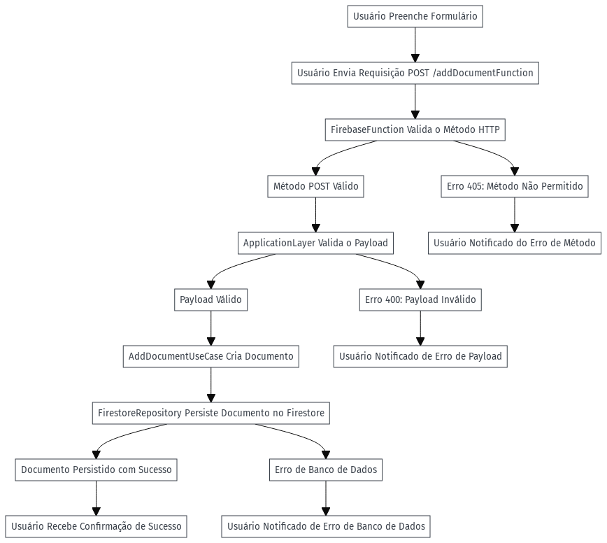

# Documentação do Projeto

## Introdução

Este projeto utiliza Firebase Functions para criar e gerenciar registros no Firestore, implementando uma arquitetura escalável e seguindo os princípios de `Clean Code` e `Clean Architecture`. Ele se baseia em camadas bem definidas, facilitando a manutenibilidade e expansão do projeto.

## Objetivo

O objetivo é fornecer uma arquitetura para gerenciar documentos no Firestore, incluindo a validação de payload, tratamento de erros, e suporte para crescimento escalável. Cada requisição para `addDocumentFunction` passa por validações, execução do caso de uso e interação com o Firestore.

---

## Arquitetura do Projeto

A arquitetura é baseada em **Clean Architecture**, que separa responsabilidades e facilita a manutenção e escalabilidade. Cada camada tem uma responsabilidade única e clara, isolando a lógica de negócio da infraestrutura.

### Camadas da Arquitetura

1. **User (Ator Externo)**:
   - O usuário ou um sistema externo que envia a requisição HTTP `POST /addDocumentFunction`.

2. **FirebaseFunction (Interface de Entrada)**:
   - Recebe a requisição HTTP, valida o método e o payload.
   - Encaminha a requisição para a camada de aplicação, onde a lógica de negócio é processada.
   - Em caso de sucesso, envia uma resposta ao cliente com o status 200 (OK).
   - Em caso de erro, utiliza o `ErrorHandler` para lidar com erros e responde ao cliente com o código de erro apropriado (ex: 400 ou 405).

3. **ApplicationLayer (Camada de Aplicação)**:
   - Esta camada contém as validações do payload.
   - Sua função principal é verificar se os dados enviados pelo usuário são válidos.
   - Após a validação, invoca o caso de uso (use case) correspondente.

4. **AddDocumentUseCase (Casos de Uso)**:
   - Contém a lógica de negócio para adicionar um novo documento.
   - Recebe o payload validado e cria um objeto `Document`.
   - Interage com o `FirestoreRepository` para persistir os dados no banco de dados.
   - Retorna o sucesso ou erro da operação.

5. **FirestoreRepository (Repositório de Infraestrutura)**:
   - Gerencia a comunicação direta com o banco de dados Firestore.
   - Sua principal responsabilidade é adicionar o documento no Firestore.
   - Também lida com possíveis erros de banco de dados e retorna o resultado ao caso de uso.

6. **FirestoreDB (Banco de Dados Firestore)**:
   - O banco de dados onde os documentos são armazenados.
   - O Firestore armazena os documentos criados e os recupera conforme necessário.

7. **ErrorHandler (Tratamento de Erros)**:
   - Garante que qualquer erro, seja de método HTTP inválido ou problemas com o Firestore, seja capturado e tratado de maneira adequada.
   - Lida com erros comuns como `405 Method Not Allowed` (Método não permitido) e `400 Bad Request` (Requisição inválida).
   - Retorna a mensagem de erro corretamente formatada para o cliente.

---
## Diagramas



---

[](https://mermaid.live/edit#pako:eNp1k82O2jAQx1_F8qkrsTSEhI8cVoKGiANqER89VFxmY7NYJXZqO6h0xcOseqj6HLxYbWMCC-ohkuP5zf8_M7ZfcS4IxQlW9EdFeU5TBi8SihVHqASpWc5K4BotESi0VNXxTTJxG8wyG82YpM-gaFbxXDPBb6nBxFKDstyyHCwwgT2Vd1TqrAaEpCKvCsr1UtFPRvbOdHY2VVpIOqOlUMys9rdgOnwHpsNbYDS2wEhKIcfAyfZU1PLx6SnLEjTiOwZImvEwxY5_jr8Fmn6ZL9BHuJR43XKW-cSvsGUEkEDF8a8WRKDxYjH1hEGWibNEURCjD4oibpXXQjr1h1ppMLEl5FAwvrFiJey3AohtANDOWbiibMJg4hNqa0_74DvXwLme5awx47vjm0kUDxex1CRMPeOjDZRLMxHiez85p25cs_O46uCpznr4rq2ZQdNhYs7YnIDgN1ImfDZOLypUKqa0cUe5KJCqcqpU7ey7nl_tumbtKVxt1nO_6IIv4V73VMZo7OdFKHoGnrsFMbiyzGjsBT8LzdbmViP6HxY3cEFlAYyYp_Zqc1dYb2hBVzgxSwLy-wqv-MFwUGkx3_McJ1pWtIGlqF42OFnDVpm_qiSgz4-03jXXGCev-CdOHsO4GYRh1InMF7fDdj9q4D1OWq1esxN0--2w142joBP3Dw38Swij0Wp2u712t92Pw14UBd1O7AS_uaCt4fAPuAJiwg)

---

### Fluxo de Execução - Adicionar Documento

1. **Usuário envia uma requisição POST**:
   - O usuário faz uma requisição `POST` com um payload (ex: `{"name": "Marcos Feliz"}`).

2. **Recebimento pela `FirebaseFunction`**:
   - A função Firebase recebe a requisição e verifica se o método é `POST`.
   - Em caso de método diferente de `POST`, a função retorna um erro `405 Method Not Allowed`.

3. **Validação de Payload**:
   - O payload recebido é encaminhado para a **ApplicationLayer**.
   - A camada de aplicação valida se o campo `name` está presente e se atende aos critérios (ex: não pode estar vazio, deve ter no mínimo 3 caracteres).

4. **Execução do Caso de Uso (`AddDocumentUseCase`)**:
   - Se o payload for válido, o caso de uso `AddDocumentUseCase` é chamado.
   - Um novo objeto `Document` é criado a partir do payload.
   - O caso de uso então chama o `FirestoreRepository` para adicionar o documento no Firestore.

5. **Persistência no Firestore (`FirestoreRepository`)**:
   - O `FirestoreRepository` interage diretamente com o banco de dados Firestore, adicionando o novo documento à coleção correta.

6. **Retorno do Resultado**:
   - Se o documento for adicionado com sucesso, o repositório retorna o resultado para o caso de uso.
   - O caso de uso, por sua vez, retorna à camada de aplicação.
   - Finalmente, a função Firebase envia uma resposta com o código `200 OK` e uma mensagem de sucesso para o cliente.

### Tratamento de Erros

1. **Erro de Validação de Payload**:
   - Se o payload não for válido (ex: campo `name` ausente ou inválido), a camada de aplicação detecta o erro e retorna um erro `400 Bad Request`.
   - O `ErrorHandler` captura o erro e garante que a resposta seja enviada corretamente.

2. **Erro de Método Não Permitido**:
   - Se a requisição utilizar um método diferente de `POST`, o `ErrorHandler` é chamado para retornar um erro `405 Method Not Allowed`.
   - Isso garante que apenas requisições com o método correto sejam aceitas.

3. **Erro de Banco de Dados**:
   - Qualquer erro relacionado ao Firestore (ex: falha ao adicionar o documento) é capturado e tratado pelo `ErrorHandler`.
   - A resposta enviada ao cliente reflete o erro de banco de dados ocorrido.

---

### Como Rodar o Projeto

1. **Instalar Dependências**:
   ```bash
   npm install
   ```

2. **Compilar o TypeScript**:
   Antes de iniciar os emuladores do Firebase, compile o código TypeScript:
   ```bash
   npm run build
   ```

3. **Iniciar os Emuladores do Firebase**:
   ```bash
   firebase emulators:start
   ```

4. **Rodar Testes**:
   Execute os testes unitários:
   ```bash
   npm test
   ```

5. **Implantação (Opcional)**:
   Se desejar implantar no Firebase:
   ```bash
   firebase deploy --only functions
   ```

---

### Conclusão

Este projeto utiliza uma arquitetura modular, flexível e escalável. A separação em camadas permite fácil manutenção e teste, garantindo que as diferentes partes do sistema possam ser modificadas independentemente.
